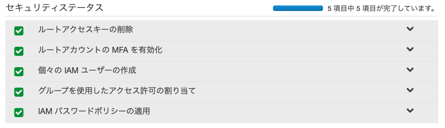

# iac

## ルートアカウントでの基本設定

AWS の新規アカウントを作成した後、AWS マネジメントコンソールからルートアカウントでログインします。
その後、IAM のコンソールへ移動し、セキュリティステータスにすべてチェックがつくまで対応を行ってください。



1. ルートアカウントの MFA を有効化
2. 個々の IAM ユーザーの作成/グループを使用したアクセス許可の割り当て
  - 管理者用ユーザーを作る
    - 「ユーザー名」には適切な名前を入力
    - 「アクセスの種類」は「AWS マネジメントコンソールへのアクセス」にのみチェック
    - 「ユーザーをグループに追加」を選択し、「グループの作成」を押下し、管理者グループを追加します
      - 「グループ名」は適切なグループ名を入力する (ここでは `admin-group` とする)
      - `AdministratorAccess` を選択し、「グループの作成」を押下
    - 「ユーザーをグループに追加」で先程作成した `admin-group` を選択し、「次のステップ: タグ」を押下
    - 「次のステップ: 確認」を押下
    - 「ユーザーの作成」を押下
3. IAM パスワードポリシーの適用
  - 「パスワードポリシーを設定する」を押下し、パスワードポリシーを以下のように設定
    - パスワードの最小文字数を強制する、で `15` 文字を設定
    - 以下にチェック
      - 1 文字以上のアルファベット大文字 (A～Z) を必要とする
      - 1 文字以上のアルファベット小文字 (a～z) を必要とする
      - 少なくとも 1 つの数字が必要
      - 少なくとも 1 つの英数字以外の文字が必要 (!@#$%^&*()_+-=[]{}|')
      - ユーザーにパスワードの変更を許可する

その後、ルートユーザーをログアウトし、上記で作成したユーザーを用いて再度 AWS マネジメントコンソールからログインしてください。

## Terraform 用アカウントの用意

1. コンソールにログイン後、IAM のコンソールから「ユーザー」を選択
2. 自身のユーザー名を選択
3. 「認証情報」タブを選択し、「アクセスキーの作成」を押下
4. 表示されたアクセスキーID、シークレットアクセスキーをメモし厳重に保管するようにしてください

```bash
$ aws iam create-group --path / --group-name terraform-group
$ aws iam create-user --user-name terraform
$ aws iam add-user-to-group --user-name terraform --group-name terraform-group
```
